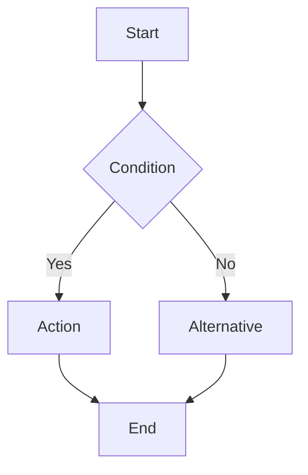

# Specification Template

Use this template when generating specifications from legacy code analysis.

## Template

```markdown
# {Component Name} Specification

**Extracted From**: {source files}  
**Extraction Date**: {date}  
**Confidence Level**: High | Medium | Low

## Overview

{2-3 sentences describing the component's purpose based on code analysis}

## User Stories

### US-001: {Primary User Action}
**As a** {user type inferred from code}  
**I want to** {action the code enables}  
**So that** {benefit/outcome}

**Acceptance Criteria:**
- [ ] {Criterion derived from validation logic}
- [ ] {Criterion derived from success paths}

## Business Rules

| ID | Rule Name | Description | Source | Confidence |
|----|-----------|-------------|--------|------------|
| BR-001 | {Name} | {What the rule does} | {file:line} | High/Med/Low |
| BR-002 | {Name} | {What the rule does} | {file:line} | High/Med/Low |

### Rule Details

#### BR-001: {Rule Name}
- **Trigger**: {When this rule is evaluated}
- **Condition**: {The check performed}
- **Action**: {What happens when condition is true/false}
- **Source Evidence**: 
  ```{language}
  // Relevant code snippet
  ```

## Data Model

### {Entity Name}
| Field | Type | Required | Constraints | Notes |
|-------|------|----------|-------------|-------|
| {field} | {type} | Yes/No | {validation} | {from code comments} |

### Relationships
- {Entity A} → {Entity B}: {relationship type and cardinality}

## Process Flows

### {Process Name}


**Steps:**
1. {Step description} - Source: {file:line}
2. {Step description} - Source: {file:line}

## External Dependencies

| System | Purpose | Evidence |
|--------|---------|----------|
| {name} | {why it's called} | {file:line} |

## Technical Debt & Observations

### Issues Found
- [ ] **{Issue Type}**: {Description} - {file:line}

### Recommendations
1. {Recommendation for modernization}
2. {Recommendation for improvement}

## Confidence Notes

{Explain any areas of uncertainty or assumptions made during extraction}
```

## Confidence Levels

- **High**: Clear code with comments, consistent patterns, explicit business logic
- **Medium**: Logic is clear but lacks documentation, some assumptions required
- **Low**: Complex/unclear code, conflicting patterns, significant assumptions made
